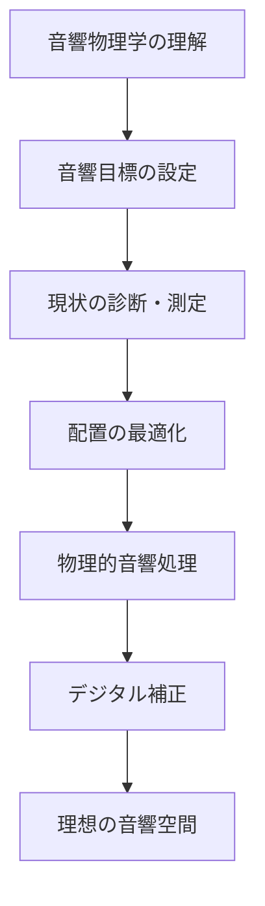

## **目次**
1. [序論：最後の、そして最も重要なコンポーネントとしての「部屋」](#introduction)
2. [第1章：戦場の理解：部屋における音の物理学と心理音響学](#chapter-1)
3. [第2章：音響目標の定義：設計思想と国際基準](#chapter-2)
4. [第3章：診断：自室の音響特性を測定し解釈する](#chapter-3)
5. [第4章：最初にして最も強力な対策：スピーカーとリスナーの配置](#chapter-4)
6. [第5章：介入：実践的音響処理ガイド](#chapter-5)
7. [第6章：最終的な磨き上げ：高度技術とデジタル補正](#chapter-6)
8. [結論：理論から聴覚的至福へ](#conclusion)
9. [付録](#appendix)

---

<h2 id="introduction">**序論：最後の、そして最も重要なコンポーネントとしての「部屋」**</h2>

### **📋 この章の要点**
- オーディオ再生において、部屋は最も重要でありながら最も見過ごされがちな要素
- 石井伸一郎氏：「良い音が得られない原因はほぼ100%、部屋にある」
- 本ガイドは科学的原則に基づいた体系的アプローチで、誰でも実践できる改善手法を提供

### **前提：オーディオ再生における部屋の支配的影響力**

ハイファイオーディオシステムを構築する上で、多くの愛好家はスピーカー、アンプ、プレーヤーといったコンポーネントの選定に多大な時間と情熱、そして予算を投じます。しかし、オーディオ再生における最終的な音質を決定づける最も重要な要素は、それらの機器が設置される「部屋」そのものであるという事実は、しばしば見過ごされがちです。オーディオコミュニティにおける長年の経験則と、音響工学の科学的知見は、この点において完全に一致しています。すなわち、音響的に劣悪な部屋では最高級の機器もその真価を発揮できず、逆に、適切に音響処理された部屋では、比較的安価なシステムでさえ驚くほど優れたサウンドを実現し得るのです <sup>1</sup>。

石井伸一郎氏が提唱するように、優れた機器を組み合わせても良い音が得られない場合、その原因は「ほぼ100%、部屋にある」と断言できます <sup>1</sup>。このレポートは、このオーディオにおける根源的な課題に正面から向き合い、一般家庭の既存のリスニングルームを、科学的原則に基づいた実践的な手法で改善するための包括的なガイドです。

### **課題と機会：小部屋特有の音響問題**

このガイドが焦点を当てるのは、コンサートホールやプロフェッショナルなスタジオのような大規模空間ではなく、一般的な家庭に見られる「小部屋（small room）」です。小部屋の音響は、大規模空間とは根本的に異なる物理法則に支配されており、特有の課題を抱えています <sup>2</sup>。

**小部屋特有の課題：**
- **低周波の共鳴（定在波）**：部屋の寸法に関連した特定の周波数での強い共振
- **不快な反響（フラッターエコー）**：平行面間での音の往復による金属的な響き
- **音色の歪み（コムフィルタリング）**：直接音と反射音の干渉による櫛型の周波数特性

これらの課題を理解することは、効果的な対策を講じるための第一歩となります。本レポートでは、部屋の音響を克服不可能な障害としてではなく、音質を飛躍的に向上させるための最大の「機会」として捉えます。

### **ロードマップ：理論から実践への体系的アプローチ**

本ガイドは、読者が自らのリスニング環境の「主治医」となることを目指し、以下の体系的なロードマップに従って構成されています：



1. **音響物理学の理解**：まず、部屋の中で音がどのように振る舞うか、その物理的・心理音響学的な基本原則を学びます。
2. **音響目標の設定**：次に、プロのスタジオ設計思想や国際基準を参考に、「良い音の部屋」とはどのような状態かを定義し、具体的な目標を設定します。
3. **現状の診断**：音響測定ソフトウェアを用いて自室の音響特性を「見える化」し、問題点を正確に特定する方法を解説します。
4. **実践的対策**：最後に、診断結果に基づき、「スピーカーとリスニングポジションの最適化」という最も基本的かつ強力な対策から始め、低音域、中高音域それぞれに対する物理的な音響処理（吸音・拡散）、そして最終的な仕上げとしてのデジタル補正技術まで、段階的かつ具体的な解決策を詳述します。

---

<h2 id="chapter-1">**第1章：戦場の理解：部屋における音の物理学と心理音響学**</h2>

### **📋 この章で学べること**
- 直接音、反射音、残響音の違いと、それぞれが音質に与える影響
- 小部屋特有の音響障害（ルームモード、フラッターエコー、コムフィルタリング）の物理的メカニズム
- 波動音響学と幾何音響学の違い、およびシュレーダー周波数の重要性
- ハース効果、ASW、LEVなど、人間の聴覚メカニズムが音響知覚に与える影響

### **1.1. 音の旅路：直接音、反射音、残響音場**

リスナーの耳に届く音は、単一の音ではありません。それは、時間的に異なる複数の要素が複雑に合成されたものです。これらを理解することは、ルームアコースティックの第一歩です。

#### **音の3要素の詳細**

* **直接音（Direct Sound）**：スピーカーから放射され、壁や天井、床などに一度も反射せずにリスナーの耳に直接到達する音です。音源の基本的な音色や定位情報（どこから音が鳴っているか）を決定づける最も重要な成分です。

* **初期反射音（Early Reflections）**：直接音の直後に、壁、床、天井といった室内の境界面で一度だけ反射して耳に届く音群です。これらの反射音は、音の広がり感や空間の大きさといった「音場感」の形成に大きく寄与しますが、強すぎたり、直接音との時間差が短すぎたりすると、音像をぼやけさせ、音色を変化させる原因ともなります <sup>2</sup>。

* **後期反射音（残響音場、Reverberant Field）**：何度も壁面間で反射を繰り返した結果、無数の方向からランダムな位相で耳に到達する密度の高い音の集合体です。この残響が豊かであると、音楽に包み込まれるような心地よい「響き」や「臨場感」が生まれます。しかし、過剰な残響は音の明瞭度を著しく低下させます。

#### **音場の領域と臨界距離**

```
音場の領域区分：
スピーカー → 近距離音場 → 自由音場 → 臨界距離 → 残響音場
         (〜λ/2π)    (直接音優位)  (D=R)   (反射音優位)
```

* **臨界距離（Critical Distance, Dc）**：直接音のエネルギーと、すべての反射音からなる残響音のエネルギーが等しくなるスピーカーからの距離を指します。この臨界距離よりも手前で聴くこと（ニアフィールドリスニング）は、部屋の反射音の影響を相対的に低減させる有効な戦略の一つです <sup>2</sup>。

臨界距離の計算式：
```
Dc = 0.057 × √(V × Q / RT60)
```
ここで、V = 部屋の容積(m³)、Q = スピーカーの指向係数、RT60 = 残響時間

* **音場の領域**：音場は、音源直近の「近距離音場（Near Field）」と、それより遠い「遠距離音場（Far Field）」に分けられます。遠距離音場はさらに、直接音が支配的な「自由音場（Free Field）」と、反射音が支配的な「残響音場（Reverberant Field）」に区別されます。再現性が高く意味のある音響測定は、この自由音場内で行うのが基本となります <sup>2</sup>。

### **1.2. 音響的な敵：室内における主要な音響障害**

理想的な音響空間の実現を阻む、いくつかの典型的な「音響障害」が存在します。これらは特に小部屋において顕著に現れます。

#### **ルームモード（定在波、Standing Waves）**

小部屋における最大の音響問題です。部屋の向かい合う平行な壁面（壁と壁、床と天井など）の間で、特定の周波数の音が共鳴し、定常的な波を形成する現象です <sup>2</sup>。

**モードの計算式：**
```
f = (c/2) × √[(nx/Lx)² + (ny/Ly)² + (nz/Lz)²]
```
ここで、c = 音速(343 m/s)、n = モード次数、L = 部屋の寸法

**モードの種類と特性：**

| モードの種類 | 関与する面 | エネルギー | 減衰特性 | 問題の深刻度 |
|------------|----------|----------|---------|-------------|
| **軸モード（Axial）** | 2面（対向） | 最大 | 最も遅い | 最も深刻 |
| **接線モード（Tangential）** | 4面 | 軸の1/2 | 中程度 | 中程度 |
| **斜めモード（Oblique）** | 6面 | 軸の1/4 | 最も速い | 最小 |

定在波は、2つの対向面で発生する**軸モード（Axial Mode）**、4つの面が関与する**接線モード（Tangential Mode）**、6つ全ての面が関与する**斜めモード（Oblique Mode）**の3種類に分類されます。このうち、エネルギーが最も強く、減衰しにくいため最も問題となるのが軸モードです <sup>5</sup>。

#### **フラッターエコー（Flutter Echo）**

平行で硬い反射面の間で、拍手のような短い音が「ピチピチピチ…」と鳴き竜のように響き続ける現象です。これは中高音域の問題であり、音の明瞭度や繊細な余韻の再現を妨げます <sup>4</sup>。

**発生条件：**
- 平行な硬い反射面
- 反射面間の距離が数メートル以上
- 吸音・拡散処理の不足

#### **コムフィルタリング（Comb Filtering）**

直接音と、ごくわずかに遅れて到達した反射音が干渉し合うことで、周波数特性上に櫛（Comb）の歯のような無数の鋭いピークとディップが生まれる現象です <sup>7</sup>。

**コムフィルタリングの特徴：**
- ディップの周波数：f = 1/(2×Δt)、3/(2×Δt)、5/(2×Δt)...
- ピークの周波数：f = 1/Δt、2/Δt、3/Δt...
（Δt = 直接音と反射音の時間差）

### **1.3. 小部屋の難問：波動音響学 vs 幾何音響学**

コンサートホールのような大規模空間と、私たちが日常的に使用するリスニングルームのような小部屋とでは、音の振る舞いを解析するための学問的アプローチが根本的に異なります。

#### **シュレーダー周波数（Schroeder Frequency）**

部屋の音響特性が、低周波数帯で支配的な「波動的挙動（定在波）」から、高周波数帯で支配的な「幾何学的挙動（光線のような反射）」へと移行するおおよその境界となる周波数を指します <sup>3</sup>。

**シュレーダー周波数の計算式：**
```
fs = 2000 × √(RT60 / V)
```
ここで、RT60 = 残響時間(秒)、V = 部屋の容積(m³)

この周波数は部屋の容積と残響時間によって決まり、小部屋では一般的に200 Hzから400 Hzあたりに存在します。

**解析アプローチの違い：**

| 空間タイプ | シュレーダー周波数 | 主要な解析手法 | 音響処理の重点 |
|----------|----------------|--------------|--------------|
| **大規模空間** | 〜50Hz | 幾何音響学 | 反射音制御 |
| **小部屋** | 200-400Hz | 波動音響学＋幾何音響学 | モード制御＋反射音制御 |

この事実は、小部屋の音響対策がなぜ二段構えでなければならないかを明確に示しています。シュレーダー周波数以下の低音域に対しては「定在波対策（ベーストラップなど）」が、それ以上の周波数帯に対しては「反射音制御（吸音・拡散）」が、それぞれ必要となるのです。

### **1.4. 心理音響学の要因：脳は部屋の音をどう解釈するか**

私たちが最終的に「聴く」のは、物理的な音圧変化そのものではなく、脳がそれを解釈した結果です。したがって、人間の聴覚メカニズム、すなわち心理音響学を理解することは、物理的な対策を聴感上の改善に結びつけるための鍵となります。

#### **ハース効果（先行音効果、Precedence Effect）**

直接音と、それから約40ミリ秒以内に到達した反射音は、脳内で時間的に融合され、一つの音として知覚されます。そして、その音源の方向は、先に到達した音（直接音）の方向として認識されます <sup>8</sup>。

**ハース効果の時間領域：**
- 0-1ms：完全に融合、音色変化として知覚
- 1-5ms：融合するが、音像の広がりとして知覚
- 5-40ms：融合するが、空間情報として知覚
- 40ms以上：独立したエコーとして知覚

#### **初期時間遅延ギャップ（Initial Time Delay Gap, ITDG）**

直接音が到達してから、最初の反射音が到達するまでの時間差です。このITDGが非常に短い（10〜15ミリ秒未満）場合、脳はそれを部屋の響きとして認識できず、音源そのものが滲んだように感じてしまいます <sup>8</sup>。

**ITDGと音響印象の関係：**
- 5ms未満：音像のぼけ、音色の変化
- 15-25ms：明瞭で広がりのある音場
- 25ms以上：分離した反射音として知覚

#### **空間印象の知覚（ASW & LEV）**

物理現象は、具体的な聴感上の効果と結びついています。

* **みかけの音源の幅（Apparent Source Width, ASW）**：リスニングポジションの左右側面から到来する初期反射音は、音場の左右への広がり感（ASW）と強く相関しています <sup>3</sup>。ASWに寄与する反射音は、主に5-80msの時間窓に存在します。

* **リスナーエンベロプメント（Listener Envelopment, LEV）**：時間的に遅れて到来する拡散的な残響音場は、音に包み込まれる感覚（LEV）を生み出します <sup>3</sup>。LEVは主に80ms以降の後期反射音によって形成されます。

これらの知見は、ルームアコースティックの根本的なパラドックスを浮き彫りにします。すなわち、私たちは空間の広がり（ASW）や包囲感（LEV）を得るために反射音を必要としますが、制御されていない初期反射音は音像定位を破壊し（ハース効果、コムフィルタリング）、低周波の反射は深刻な音色の不均衡（ルームモード）を引き起こします。したがって、「ルームチューニング」とは、単に反射音を消し去ることではなく、**時間、レベル、方向性において反射音を彫刻する（スカルプティング）**芸術的かつ科学的なプロセスなのです。

---

<h2 id="chapter-2">**第2章：音響目標の定義：設計思想と国際基準**</h2>

### **📋 この章で学べること**
- 石井式リスニングルームの設計哲学と実践的応用
- LEDE、RFZ、制御反射室などのプロスタジオ設計思想
- RT60、背景騒音、周波数特性などの客観的目標値
- 用途別（クラシック、ジャズ、ホームシアター等）の具体的な数値目標

### **2.1. 石井式リスニングルームの解明：日本の最高峰オーディオルーム哲学**

日本のオーディオファイルの間で絶大な支持を集める「石井式リスニングルーム」は、本レポートが参照する資料群においても中心的なテーマです <sup>1</sup>。その設計思想は、既存の部屋を改善する上で極めて有益な指針を与えてくれます。

#### **基本原則と理論的背景**

石井式は、長年のスピーカー開発者であった石井伸一郎氏が、膨大なシミュレーションと実験に基づいて導き出したオーディオ再生に特化した空間設計手法です <sup>1</sup>。その核心は、単一の素材や手法に頼るのではなく、「部屋の寸法比」と「吸音と反射のバランス」という2つの要素を最適化することにあります。

**石井式の3大要素：**
1. **部屋の比率**：音響的に最適な空間比率
2. **平均吸音率**：聴取する音楽に応じた吸音率の設定
3. **材料配置**：反射材と吸音材の戦略的配置

#### **部屋の寸法比の科学**

石井式では、部屋の寸法比（長さ：幅：高さ）を「1:0.845:0.725」とすることを推奨しています <sup>1</sup>。

**この比率の根拠：**
- ルームモードの周波数を最も均等に分散
- 特定周波数での極端なピーク/ディップを回避
- Bolt（1946）の研究に基づく最適化

**他の推奨比率との比較：**

| 提唱者/規格 | 比率 (L:W:H) | 特徴 |
|-----------|-------------|------|
| **石井式** | 1:0.845:0.725 | 日本の住環境に最適化 |
| **Sepmeyer** | 1:0.8:0.6 | 最もモード分散が良い |
| **Louden** | 1:0.62:0.49 | 黄金比に基づく |
| **EBU Tech 3276** | 1:0.96±0.23:0.56±0.17 | 許容範囲を規定 |

#### **表面処理の戦略**

既存の部屋に適用できる最も重要な実践的知見は、**高度に反射的な面（理想は天然木）と、高度に吸音的な面を、戦略的に（しばしば市松模様のように交互に）配置する**という手法です <sup>1</sup>。

**石井式の材料配置パターン例：**
```
天井の配置（8×8グリッドの例）：
[木][吸][木][吸][木][吸][木][吸]
[吸][木][吸][木][吸][木][吸][木]
[木][吸][木][吸][木][吸][木][吸]
[吸][木][吸][木][吸][木][吸][木]
```

#### **目標残響時間と平均吸音率**

石井氏は、聴取する音楽ジャンルに応じて最適な部屋の平均吸音率を提示しています <sup>1</sup>：

| 用途 | 平均吸音率 | RT60 (500Hz) | 音響特性 |
|-----|----------|-------------|---------|
| **クラシック音楽** | 14% | 0.4-0.5秒 | 豊かで自然な響き |
| **ジャズ・ポップス** | 19% | 0.3-0.4秒 | タイトで明瞭な音像 |
| **ホームシアター** | 24% | 0.25-0.35秒 | 極めて高い明瞭度 |
| **録音・モニタリング** | 30% | 0.2-0.25秒 | デッドで分析的 |

**平均吸音率からRT60への換算（Sabineの式）：**
```
RT60 = 0.161 × V / (S × ᾱ)
```
ここで、V = 容積(m³)、S = 総表面積(m²)、ᾱ = 平均吸音率

### **2.2. プロスタジオからの教訓：LEDE、RFZ、そして制御反射**

プロフェッショナルなレコーディングスタジオやコントロールルームの設計思想は、数十年にわたる音響工学の進化を反映しており、ホームリスニング環境にも応用できる多くの知見を含んでいます。

#### **Live End-Dead End (LEDE)**

1980年代にDon DavisとChips Davisによって開発された古典的なスタジオ設計思想です <sup>4</sup>。

**LEDE設計の原則：**
- 前方（スピーカー側）：高度に吸音的（Dead End）
- 後方（リスナー背後）：反射・拡散的（Live End）
- ITDGを20ms以上確保
- 初期反射音を抑制し、後期反射を活用

**LEDEの音響効果：**
- 極めて明瞭な直接音
- 制御された空間印象
- 正確なステレオイメージング

#### **Reflection Free Zone (RFZ)**

LEDEを発展させた考え方で、Peter D'Antonioらによって提唱されました <sup>14</sup>。

**RFZの設計原則：**
- リスニングポジション周囲に「無反射ゾーン」を形成
- 一次反射点のみを選択的に処理
- その他の面は拡散処理
- より自然な音場を実現

**RFZの実装方法：**
1. ミラーテクニックで一次反射点を特定
2. その位置に吸音または拡散処理
3. 天井の「クラウド」設置
4. 後方壁面の拡散処理

#### **Controlled Reflection Room（制御反射室）**

特にマルチチャンネルオーディオで用いられる現代的なアプローチです <sup>15</sup>。

**制御反射室の特徴：**
- 反射音を積極的に利用
- 時間・レベル・方向を精密に制御
- 吸音・拡散・反射面の組み合わせ
- 傾斜壁面の活用

**各設計思想の比較：**

| 設計思想 | 初期反射 | 後期反射 | 適用環境 | 音響特性 |
|---------|---------|---------|---------|---------|
| **LEDE** | 完全抑制 | 活用 | 2ch/ステレオ | 分析的・明瞭 |
| **RFZ** | 選択的抑制 | 活用 | 2ch/マルチ | バランス型 |
| **制御反射** | 積極利用 | 精密制御 | マルチチャンネル | 空間的・自然 |

### **2.3. 客観的目標の確立：国際規格と目標カーブ**

音響改善を主観的な「良くなった気がする」というレベルから、客観的で再現性のあるエンジニアリングへと昇華させるためには、測定可能な目標値を設定することが不可欠です。

#### **残響時間（RT60）の国際規格**

音が鳴り止んでから、その音圧レベルが60 dB減衰するまでにかかる時間をRT60と定義します。これは部屋の「響きの長さ」を定量化する最も基本的な指標であり、その測定方法はISO 3382として国際的に標準化されています <sup>16</sup>。

**主要な国際規格と推奨値：**

| 規格/団体 | 用途 | RT60推奨値 | 備考 |
|----------|------|-----------|------|
| **ITU-R BS.1116** | クリティカルリスニング | 0.2-0.4秒 | 高品質オーディオ評価用 |
| **EBU Tech 3276** | 放送スタジオ | 0.2-0.3秒 | ヨーロッパ放送連合基準 |
| **IEC 60268-13** | リスニングルーム | 0.3-0.5秒 | 民生オーディオ用 |
| **THX** | ホームシアター | 0.2-0.3秒 | 映画音響基準 |

#### **背景騒音レベル**

微細な音のディテールを聴き取るためには、部屋自体の静けさが重要です。

**ノイズクライテリオン（NC）カーブ：**

| NCレベル | dB(A) | 用途例 | 聴感上の特徴 |
|---------|-------|--------|-------------|
| **NC-15** | 25以下 | 録音スタジオ | ほぼ無音 |
| **NC-20** | 30以下 | 高級リスニングルーム | 極めて静か |
| **NC-25** | 35以下 | 一般的なリスニングルーム | 十分静か |
| **NC-30** | 40以下 | ホームシアター | 許容レベル |

#### **周波数特性の目標カーブ**

リスニングポジションにおける周波数特性は、完全にフラットであることが必ずしも聴感上最良とは限りません。

**代表的なターゲットカーブ：**

1. **Harman Target Curve**（Sean Olive/Floyd Toole）
   - 低域：20-200Hzで+3〜+6dB
   - 中域：200Hz-2kHzでフラット
   - 高域：2kHz以上で-2dB/octaveで減衰

2. **B&K Curve（Brüel & Kjær）**
   - より緩やかな高域減衰
   - プロスタジオで広く採用

3. **石井式推奨カーブ**
   - 低域のわずかな上昇
   - 高域の自然な減衰
   - 日本の住環境に最適化

### **表1：用途別目標値の総合ガイド**

| 用途 | RT60 (125Hz) | RT60 (500Hz) | RT60 (2kHz) | RT60 (8kHz) | 背景騒音 | 備考 |
|-----|-------------|-------------|------------|------------|---------|------|
| **2chクリティカル（クラシック）** | 0.5-0.6秒 | 0.4-0.5秒 | 0.35-0.45秒 | 0.3-0.4秒 | NC-20以下 | 石井式14%吸音率相当 |
| **2chクリティカル（ジャズ/ロック）** | 0.4-0.5秒 | 0.3-0.4秒 | 0.25-0.35秒 | 0.2-0.3秒 | NC-25以下 | 石井式19%吸音率相当 |
| **イマーシブ・ホームシアター** | 0.3-0.4秒 | 0.25-0.35秒 | 0.2-0.3秒 | 0.15-0.25秒 | NC-30以下 | 石井式24%吸音率相当 |
| **ボーカル/楽器録音** | &lt;0.4秒 | &lt;0.3秒 | &lt;0.25秒 | &lt;0.2秒 | NC-15以下 | 極めてデッド |

---

<h2 id="chapter-3">**第3章：診断：自室の音響特性を測定し解釈する**</h2>

### **📋 この章で学べること**
- プロ級の測定を低コストで実現する機材選定
- REWを使った科学的に正確な測定手順
- 測定データから問題点を特定する解析技術
- 典型的な問題パターンの診断と優先順位付け

### **3.1. 音響測定ツールキット：ハードウェアとソフトウェア**

プロ用の高価な機材は必要ありません。現在では、低コストかつ高性能なツールが容易に入手可能です。

#### **ソフトウェア：Room EQ Wizard (REW)**

フリーウェアでありながら、プロ用ソフトウェアに匹敵する多機能と精度を誇る音響測定ソフトウェアのデファクトスタンダードです <sup>7</sup>。

**REWの主要機能：**
- SPL測定（周波数特性）
- インパルス応答測定
- RT60測定（残響時間）
- ウォーターフォール/スペクトログラム表示
- EQ最適化機能
- 位相/群遅延測定
- 歪み測定（THD）

#### **ハードウェア：測定用マイクロフォンと関連機器**

**測定用マイクロフォンの要件：**
- 無指向性（Omnidirectional）特性
- フラットな周波数特性（20Hz-20kHz）
- 個別校正データ付属
- 低ノイズ、高感度

**推奨測定マイクロフォン：**

| モデル | 価格帯 | 特徴 | 備考 |
|-------|--------|------|------|
| **miniDSP UMIK-1** | 15,000円前後 | USB接続、個別校正済み | 最も人気、入手容易 |
| **Dayton Audio UMM-6** | 12,000円前後 | USB接続、個別校正済み | コストパフォーマンス良好 |
| **BEHRINGER ECM8000** | 5,000円前後 | XLR接続、汎用校正 | 別途オーディオI/F必要 |
| **Earthworks M30** | 10万円以上 | プロ仕様、極めて高精度 | 予算が許せば最高 |

**その他の必要機器：**
- **音圧レベル（SPL）メーター**：測定レベルの校正用（3,000-5,000円）
- **マイクスタンド**：振動遮断、高さ調整可能なもの（3,000-5,000円）
- **オーディオインターフェース**：XLRマイク使用時（10,000円〜）

### **3.2. 正確な室内音響測定へのステップ・バイ・ステップガイド**

以下の手順に従うことで、誰でも信頼性の高い測定データを取得できます。

#### **1. 機材のセットアップとREWの初期設定**

**REW初期設定の詳細：**

1. **入出力デバイス設定**
   ```
   Preferences → Soundcard
   - Input: 測定マイク（UMIK-1等）
   - Output: オーディオシステム
   - Sample Rate: 48kHz推奨
   ```

2. **校正ファイルの読み込み**
   ```
   Preferences → Mic/Meter → Calibration Files
   - マイクのシリアル番号に対応したファイルを選択
   - 90°（0°）用ファイルを使用
   ```

3. **SPLメーター校正**
   ```
   Preferences → Mic/Meter → SPL Meter
   - C-weighted, Slow設定
   - 75dB SPLのテスト信号で校正
   ```

#### **2. 測定環境の準備**

**チェックリスト：**
- [ ] 室温：20-25℃（音速に影響）
- [ ] 湿度：40-60%（高周波吸収に影響）
- [ ] 騒音源の停止（エアコン、換気扇等）
- [ ] マイク位置：耳の高さ、顔の位置
- [ ] ケーブル配置：マイクスタンドから離す

#### **3. 測定の実行**

**重要な測定パラメータ：**
```
Measurement設定：
- Start Freq: 20 Hz
- End Freq: 20,000 Hz
- Level: -12 to -20 dB FS
- Sweep Length: 256k推奨
- Repetitions: 3-5回平均
```

**測定手順：**
1. **レベルチェック**：Check Levelsで適正レベル確認
2. **左チャンネル測定**：左スピーカーのみON
3. **右チャンネル測定**：右スピーカーのみON
4. **ステレオ測定**：参考用（メインは個別測定）

> ⚠️ **最重要注意事項**：
> **L/Rを同時に測定してはいけません。**必ず個別測定を行い、問題を正確に把握してください <sup>23</sup>。

### **3.3. データの解読：グラフから問題点を発見する方法**

測定が完了すると、REWは様々なグラフを生成します。これらのグラフを正しく読み解くことで、部屋が抱える問題点を特定できます。

#### **周波数特性（SPL Graph）の解析**

**表示設定の推奨値：**
- Y軸範囲：45-105 dB（60dBレンジ）
- スムージング：1/24 octave（詳細）〜1/3 octave（概観）
- 表示範囲：20Hz-20kHz（対数スケール）

**問題の特定基準：**

| 周波数帯域 | 許容偏差 | 要注意偏差 | 深刻な問題 |
|-----------|---------|-----------|-----------|
| 20-200Hz | ±6dB | ±10dB | ±15dB以上 |
| 200Hz-2kHz | ±3dB | ±5dB | ±8dB以上 |
| 2k-20kHz | ±5dB | ±8dB | ±10dB以上 |

#### **ウォーターフォール/スペクトログラム解析**

ウォーターフォールグラフは周波数特性に時間軸を加えた3次元表示で、音の減衰特性を可視化します。

**ウォーターフォール設定：**
```
Window: 500ms
Rise Time: 0ms (フルレンジ表示)
Slice Interval: 5-10ms
```

**問題の識別：**
- **長い尾根（Ridge）**：モードのリンギング
- **遅い減衰**：過剰な残響
- **不均一な減衰**：周波数による減衰速度の差

#### **インパルス応答とETC（Energy Time Curve）**

**読み取るべき情報：**
1. **直接音のピーク**：基準点（0ms）
2. **初期反射音**：5-80msの範囲
3. **ITDG**：最初の強い反射までの時間
4. **後期エネルギー**：80ms以降の減衰

**問題の判定基準：**
- ITDG < 10ms：音像のぼけ
- 20ms以内に-10dB以内の反射：要対策
- 不規則な減衰：フラッターエコーの可能性

#### **RT60測定と解析**

REWのRT60機能は、各周波数帯域での残響時間を自動計算します。

**測定方法の種類：**
- **T20**：-5dBから-25dBの減衰から推定（最も安定）
- **T30**：-5dBから-35dBの減衰から推定
- **EDT**（Early Decay Time）：初期減衰時間

**評価基準：**
```
理想的なRT60バランス：
125Hz / 500Hz = 1.2-1.5
250Hz / 500Hz = 1.1-1.3
1kHz / 500Hz = 0.9-1.0
4kHz / 500Hz = 0.8-0.9
```

### **3.4. 測定結果の典型的パターンと診断**

実際の測定で頻繁に遭遇する問題パターンとその対策優先順位を示します。

#### **5つの典型的問題パターン**

**1. 低域ブーム型**
```
特徴：
- 50-80Hzに+10dB以上のピーク
- ウォーターフォールで長いリンギング
- 低音が「ボワボワ」「ブーミー」

原因：強い軸モード共振
優先対策：コーナーベーストラップ
```

**2. 低域痩せ型**
```
特徴：
- 60-120Hzに-10dB以上のディップ
- 位置を動かすと大きく変化
- ベースラインが聞き取りにくい

原因：SBIR（境界面干渉）
優先対策：スピーカー位置変更
```

**3. コムフィルター型**
```
特徴：
- 300Hz以上で規則的な凹凸
- 音色が不自然
- ボーカルが鼻にかかる

原因：強い初期反射
優先対策：一次反射点の吸音
```

**4. 過残響型**
```
特徴：
- RT60が全帯域で目標値の2倍以上
- 音がぼやける、明瞭度が低い
- エコーっぽい

原因：吸音不足
優先対策：全体的な吸音追加
```

**5. 過吸音型**
```
特徴：
- 高域が-10dB以上減衰
- RT60が0.2秒未満
- 音が死んでいる、つまらない

原因：吸音過多（特に薄い吸音材）
優先対策：拡散材追加、吸音材削減
```

#### **問題の優先順位決定マトリクス**

| 問題の深刻度 | 聴感への影響 | 対策の難易度 | 優先順位 |
|------------|------------|-----------|---------|
| 低域の大きなピーク/ディップ | 極大 | 中 | 最優先 |
| 過剰な残響（低域） | 大 | 易 | 優先 |
| 強い初期反射 | 大 | 易 | 優先 |
| 高域の減衰 | 中 | 易 | 通常 |
| 細かい周波数特性の乱れ | 小 | 難 | 最後 |

### **📊 測定データ管理のベストプラクティス**

**データ保存の規則：**
```
ファイル名規則：
YYYY-MM-DD_部屋名_測定点_条件.mdat

例：
2024-01-15_リビング_中央_処理前.mdat
2024-01-20_リビング_中央_ベーストラップ後.mdat
```

**測定ログの記録項目：**
- 日時、温度、湿度
- マイク位置（3次元座標）
- スピーカー設定（レベル、EQ）
- 部屋の状態（家具配置、ドア開閉）
- 特記事項（異常音、ノイズ等）

---

<h2 id="chapter-4">**第4章：最初にして最も強力な対策：スピーカーとリスナーの配置**</h2>

### **📋 この章で学べること**
- 理想的なリスニング・トライアングルの構築法
- SBIR（境界面干渉）を回避する科学的アプローチ
- 低音のスイートスポットを見つける実践的手法
- トーイン、レイクアングル、距離の最適化技術

物理的な音響パネルを一枚も導入する前に、無料で実行可能でありながら、しばしば最も劇的な改善をもたらすのが、スピーカーとリスニングポジションの最適化です。部屋の音響問題の多くは、スピーカーがルームモードを不適切に励起し、リスナーがその影響を最も強く受ける位置にいることによって発生します。

### **4.1. 基盤の構築：リスニング・トライアングル**

最適なステレオイメージング（音像定位と音場空間の再現）の出発点は、スピーカーとリスナーの位置関係を正しく設定することです。

#### **正三角形の原則とバリエーション**

**基本配置：**
```
     [左SP] ←── D ──→ [右SP]
         ╲　         ╱
          ╲　       ╱
        D  ╲　     ╱  D
            ╲　   ╱
             ╲　 ╱
             [リスナー]
```

**配置パターンの比較：**

| パターン | SP間距離:リスナー距離 | 音場特性 | 推奨環境 |
|---------|---------------------|---------|---------|
| 正三角形 | 1:1 | バランス型 | 標準的な部屋 |
| 二等辺三角形 | 1:1.2 | 奥行き重視 | 狭い部屋 |
| ITU-R BS.775 | 1:1-1.4 | 広い音場 | 大きい部屋 |

#### **対称性の確保方法**

**精密な対称配置の手順：**
1. 部屋の中心線をマスキングテープでマーク
2. レーザー距離計で左右の壁からの距離を測定
3. 誤差を±1cm以内に調整
4. スピーカー間の距離を確認

**非対称な部屋での対処法：**
- 音響的な中心を見つける（必ずしも物理的中心ではない）
- 左右で異なる音響処理を適用
- デジタル補正で最終調整

### **4.2. 低音を制する：SBIRとポジションによるEQ**

小部屋の低音再生において、ルームモードと並んで深刻な影響を及ぼすのがSBIR（Speaker-Boundary Interference Response）です。

#### **SBIRの物理学**

**SBIRによるディップ周波数の計算：**
```
第1ディップ: f = 172 / d (Hz)
第2ディップ: f = 3 × 172 / d (Hz)
第3ディップ: f = 5 × 172 / d (Hz)

d = スピーカーから壁までの距離(m)
```

**距離と影響周波数の関係：**

| 壁からの距離 | 第1ディップ | 第2ディップ | 影響の深刻度 |
|------------|-----------|-----------|------------|
| 0.3m | 573Hz | 1719Hz | 中高域に影響 |
| 0.5m | 344Hz | 1032Hz | 中域に影響 |
| 0.86m | 200Hz | 600Hz | 重要帯域に影響 |
| 1.0m | 172Hz | 516Hz | 低中域に影響 |
| 1.5m | 115Hz | 344Hz | 低域に影響 |

#### **ポジションによる最適化戦略**

**1/3ルール：**
部屋の長さの1/3の位置にスピーカーを配置すると、軸モードの励起が最小となる理論があります。

**実践的な配置ガイドライン：**
1. **前後位置**：前壁から0.6-1.5m
2. **左右位置**：側壁から0.8m以上
3. **高さ**：ツイーターが耳の高さ
4. **床からの距離**：ウーファー中心を床から30cm以上

#### **実践的探索法「ベース・クロール」の詳細実施法**

**準備：**
```
必要機材：
- REWのRTA機能 or ピンクノイズ
- 測定マイク or 自分の耳
- 低音が豊富な参照音源
```

**実施手順：**
1. **グリッド設定**
   ```
   部屋を9-16のゾーンに分割：
   ┌───┬───┬───┬───┐
   │ 1 │ 2 │ 3 │ 4 │
   ├───┼───┼───┼───┤
   │ 5 │ 6 │ 7 │ 8 │
   ├───┼───┼───┼───┤
   │ 9 │10 │11 │12 │
   └───┴───┴───┴───┘
   ```

2. **評価基準**
   - 20-200Hzの平坦性
   - 特定周波数の突出がない
   - ベースラインの音程が明確

3. **最適位置の記録**
   - 最良位置の座標を記録
   - 次点の位置も記録（将来の参考）

#### **非対称配置の高度なテクニック**

左右のスピーカーを壁から非対称な距離に置くことで、SBIRの影響を分散できます <sup>27</sup>。

**非対称配置の例：**
```
左スピーカー：前壁から1.0m、側壁から1.2m
右スピーカー：前壁から1.3m、側壁から0.9m
```

**効果：**
- 左右で異なるSBIR周波数
- リスニング位置での相殺効果
- より平坦な低域特性

### **4.3. 音場を微調整する：トーイン、レイクアングル、リスニング距離**

基本的な配置が決まったら、次は音場の広がりや音像のフォーカスを微調整します。

#### **トーイン角度の最適化**

**角度設定の指針：**

| トーイン角度 | 音像特性 | 音場特性 | 側壁反射 | 推奨ケース |
|------------|---------|---------|---------|-----------|
| 0°（平行） | ソフト | 最も広い | 最大 | 広い部屋、複数人 |
| 10-15° | バランス | 広い | 中 | 一般的推奨 |
| 20-25° | シャープ | 標準 | 少 | 狭い部屋 |
| 30°以上 | 極めてシャープ | 狭い | 最小 | ニアフィールド |

**レーザーポインターを使った精密調整：**
1. スピーカー上面中央にレーザーを設置
2. リスナー位置の後方に目標点を設定
3. 左右対称に調整（誤差±1°以内）

#### **レイクアングル（垂直角度）の調整**

**調整が必要なケース：**
- スピーカーの高さが理想的でない
- リスニング距離が近い（&lt;2m）
- 2wayスピーカーでクロスオーバー付近の特性改善

**調整方法：**
```
傾斜角度 = arctan((ツイーター高さ - 耳の高さ) / 距離)
```

#### **リスニング距離の最適化**

**ニアフィールド vs ファーフィールド：**

| リスニングスタイル | 距離 | D/R比 | メリット | デメリット |
|------------------|------|-------|---------|-----------|
| ニアフィールド | 1-2m | 高い | 部屋の影響小 | 音場狭い |
| ミッドフィールド | 2-3m | 中 | バランス良好 | 標準的 |
| ファーフィールド | 3m以上 | 低い | 自然な音場 | 部屋の影響大 |

**部屋サイズ別推奨距離：**
- 6畳：1.5-2.2m
- 8畳：2.0-2.8m
- 12畳：2.5-3.5m

### **4.4. 配置最適化の効果測定と検証**

配置変更の効果を客観的に確認するための測定プロトコルです。

#### **Before/After測定の実施**

**測定項目チェックリスト：**
- [ ] 20-200Hzの周波数特性
- [ ] 左右チャンネルの対称性
- [ ] インパルス応答（ITDG）
- [ ] ステレオイメージング（相関meter）

**改善度の定量化：**
```
改善指標 = (変更前の偏差 - 変更後の偏差) / 変更前の偏差 × 100%
```

#### **主観評価の項目**

**試聴チェックリスト：**
1. **低域**
   - [ ] ベースラインの明瞭さ
   - [ ] キックドラムのアタック
   - [ ] 低域の均一性

2. **中域**
   - [ ] ボーカルの自然さ
   - [ ] センター定位の安定性
   - [ ] 楽器の分離

3. **高域**
   - [ ] シンバルの自然な減衰
   - [ ] 空間情報の再現
   - [ ] 耳障りな響きの有無

4. **音場**
   - [ ] 左右の広がり
   - [ ] 前後の奥行き
   - [ ] 音像の高さ情報

### **配置最適化のまとめ**

スピーカーとリスナーの配置最適化は、音響改善における最も費用対効果の高い対策です。この章で解説した手法を体系的に実施することで、物理的な音響処理を行う前に、多くの問題を解決または軽減できます。次章では、配置最適化だけでは解決できない問題に対する物理的な音響処理について詳述します。

---

<h2 id="chapter-5">**第5章：介入：実践的音響処理ガイド**</h2>

### **📋 この章で学べること**
- ベーストラップの理論と効果的な配置戦略
- 吸音と拡散の使い分けと一次反射点の処理
- DIY音響パネルの詳細な製作方法
- 予算とスキルレベルに応じた実践的ソリューション

スピーカーとリスナーの配置を最適化した後、それでも残る音響的な問題を解決するため、いよいよ物理的な音響処理材を導入します。この章では、音響問題の王様である「低音（ベース）」の制御から始め、次に音像定位と空間表現の鍵を握る「中高音」の反射制御へと進みます。

### **5.1. 低音域（〜約300 Hz）への取り組み：明瞭性の基盤**

小部屋において最も支配的で聴感上の影響が大きいのは、ルームモードによる低音域の乱れです。この帯域のレスポンスが不均一だと、中高域の繊細なディテールがマスキングされ、音楽全体の土台が崩れてしまいます。

#### **5.1.1. ベーストラップの理論と種類**

低周波エネルギーを吸収する音響処理材を総称して「ベーストラップ」と呼びます。その動作原理によって、主に2つのタイプに大別されます。

**多孔質吸音材（速度型吸音材）の物理学：**

グラスウールやロックウールといった高密度の繊維系素材が代表例です <sup>29</sup>。音波がこの素材を通過する際、空気粒子の振動（速度）が繊維との摩擦によって熱エネルギーに変換されることで音を吸収します。

**吸音係数の周波数特性：**
```
厚さと低域吸音の関係：
λ/4の厚さで最大吸音
100Hz → 86cm
200Hz → 43cm
500Hz → 17cm
```

**圧力型吸音材の種類と特性：**

| タイプ | 動作原理 | 有効周波数 | 帯域幅 | 製作難易度 |
|-------|---------|----------|--------|-----------|
| 板振動型 | 質量と剛性による共振 | 50-200Hz | 狭〜中 | 中 |
| 膜振動型 | 膜の共振 | 30-150Hz | 狭 | 高 |
| ヘルムホルツ共鳴器 | 空洞共振 | 20-200Hz | 極狭 | 極高 |
| 複合型 | 上記の組み合わせ | 30-300Hz | 広 | 高 |

#### **5.1.2. 戦略的配置：コーナーこそが最重要拠点**

ベーストラップをどこに置くべきか？その答えは明確です。**部屋のコーナー（隅）**です <sup>5</sup>。

**コーナーの音圧分布：**
```
音圧レベル（相対値）：
三面交差点（天井-壁-壁）：+9dB
二面交差点（壁-壁）：+6dB
壁面中央：+3dB
部屋中央：0dB（基準）
```

**優先順位別コーナー配置：**

1. **最優先：床-壁-壁の三面交差点**（4箇所）
2. **優先：天井-壁-壁の三面交差点**（4箇所）
3. **次点：垂直エッジ（壁-壁）**（4箇所）
4. **補助：水平エッジ（壁-天井、壁-床）**

#### **5.1.3. 実践的解決策：DIYと市販品**

**DIYスーパーチャンク型ベーストラップ詳細ガイド：**

**材料リスト（1本あたり）：**
| 材料 | 仕様 | 数量 | 概算費用 |
|-----|------|-----|---------|
| 断熱材 | グラスウール24K-50mm | 10枚 | 5,000円 |
| 透過布 | スピーカーグリル用 | 3m² | 2,000円 |
| 木材（任意） | 1×2材 | 4m | 1,000円 |
| その他 | タッカー針、接着剤等 | - | 1,000円 |

**製作手順詳細：**

1. **断熱材の準備**
   ```
   カット方法：
   □（50×50cm）→ △△（直角二等辺三角形）
   必要枚数：床から天井まで（240cmなら48枚）
   ```

2. **積層方法**
   - 最下部に木材で土台を作成（任意）
   - 三角形を隙間なく積み上げ
   - 2-3枚ごとに位置を確認

3. **仕上げ**
   - 布を前面にピンと張る
   - 側面も布で覆う（見栄え向上）
   - タッカーで確実に固定

**効果の実測例：**
```
63Hz：-8dB改善
125Hz：-6dB改善
250Hz：-4dB改善
```

**DIYパネル型ベーストラップ：**

**ストラドルマウント（コーナー設置）の効果：**
```
壁面密着：低域吸音係数 0.2-0.3
15cm離し：低域吸音係数 0.4-0.6
30cm離し：低域吸音係数 0.6-0.8
```

**市販品オプションの詳細比較：**

| 製品カテゴリ | 代表製品 | 価格帯 | 効果 | 設置難易度 |
|------------|---------|--------|------|-----------|
| チューブトラップ | ASC TubeTrap | 5-10万円/本 | 高 | 易 |
| パネル型 | RealTraps MondoTrap | 10-15万円/4枚 | 高 | 中 |
| アクティブ型 | PSI AVAA C20 | 40-50万円/台 | 極高 | 易 |
| DIYキット | GIK Acoustics | 3-5万円/4枚 | 中-高 | 中 |

### **5.2. 中高音域（〜約300 Hz以上）の制御：音場を彫刻する**

低音の土台が固まったら、次は音像定位、明瞭度、空間の広がり感を決定づける中高音域の反射音制御に移ります。

#### **5.2.1. 一次反射点の特定と処理**

**ミラーテクニックの詳細手順：**

1. **必要機材**
   - 手鏡（30×40cm程度）
   - 助手（または鏡固定器具）
   - マスキングテープ

2. **特定手順**
   ```
   リスナー視点での確認順序：
   1. 左スピーカー → 左壁反射点
   2. 右スピーカー → 右壁反射点
   3. 両スピーカー → 天井反射点
   4. 両スピーカー → 床反射点（カーペットなら不要）
   ```

3. **マーキング**
   - 反射点の中心をマーク
   - パネルサイズの輪郭も記載

**反射点の優先順位：**

| 反射面 | 影響度 | 処理の必要性 | 推奨処理 |
|-------|--------|------------|---------|
| 側壁（1次） | 極大 | 必須 | 吸音 or 拡散 |
| 天井（1次） | 大 | 強く推奨 | 吸音 |
| 床 | 大 | カーペットで可 | 吸音 |
| 後壁 | 中 | 推奨 | 拡散 |
| 前壁 | 小-中 | 任意 | 吸音 or 拡散 |

#### **5.2.2. 大いなる論争：吸音か、拡散か？**

一次反射点を特定したら、そこを「吸音」すべきか「拡散」すべきかという、ルームチューニングにおける中心的な問いに直面します。

**科学的判断基準：**

```
決定フローチャート：
                    一次反射点
                        ↓
              反射点までの距離は？
              ↓                ↓
           1m未満            1m以上
              ↓                ↓
      音場の好みは？      音場の好みは？
      ↓         ↓        ↓         ↓
    タイト    広い     タイト    広い
      ↓         ↓        ↓         ↓
   厚い吸音  薄い吸音  1D拡散   2D拡散
```

**吸音と拡散の定量的比較：**

| 処理方法 | 反射音エネルギー | 時間的拡散 | 空間的拡散 | 音場への影響 |
|---------|---------------|----------|----------|------------|
| 吸音（10cm厚） | -20dB以上 | なし | なし | デッド、明瞭 |
| 吸音（5cm厚） | -10dB程度 | なし | なし | ややデッド |
| 1D拡散 | -3dB程度 | 中 | 一方向 | 自然、広がり |
| 2D拡散 | -3dB程度 | 大 | 全方向 | 豊か、包囲感 |

#### **5.2.3. 吸音パネルの製作**

**高性能DIY吸音パネル詳細ガイド：**

**材料選定ガイド：**

| 吸音材 | 密度 | 厚さ | 用途 | 費用/m² |
|-------|------|------|------|---------|
| グラスウール32K | 32kg/m³ | 50mm | 中高域 | 1,500円 |
| グラスウール48K | 48kg/m³ | 100mm | 広帯域 | 2,500円 |
| ロックウール60K | 60kg/m³ | 100mm | 低域まで | 3,000円 |
| ポリエステル吸音材 | - | 50mm | アレルギー対策 | 4,000円 |

**製作手順（60×120cmパネル）：**

1. **フレーム製作**
   ```
   材料カット：
   - 長辺：120cm × 2本
   - 短辺：56cm × 2本（内寸60cm）
   - 深さ：吸音材厚+1cm
   ```

2. **背面処理**
   - 不織布で背面を覆う
   - 周囲をタッカー固定
   - 吸音材の脱落防止

3. **吸音材設置**
   - フレームに隙間なく充填
   - 圧縮は厳禁（性能低下）
   - 複数枚の場合は隙間をなくす

4. **仕上げ布張り**
   - 布に適度なテンションをかける
   - シワが寄らないよう注意
   - 裏面で確実に固定

**吸音性能の向上テクニック：**
- 背面に空気層を設ける（低域効果向上）
- 異なる密度の材料を層状に配置
- 表面に薄い多孔板を追加（中域調整）

#### **5.2.4. 拡散パネルの芸術**

**QRD（二次剰余拡散器）の設計と製作：**

**設計パラメータ：**
```
設計周波数 = c / (2 × 最大深さ)
例：最大深さ10cm → 1,715Hz

Well幅 = c / (2 × 上限周波数)
例：上限5kHz → 3.4cm
```

**オンライン設計ツール活用：**
1. QRDude：最も使いやすい無料ツール
2. 入力パラメータ：
   - Design frequency（設計周波数）
   - Prime number（素数：7, 11, 13等）
   - Number of periods（周期数）

**DIY製作の実際：**

**材料と工具：**
| 項目 | 仕様 | 数量 | 費用 |
|-----|------|-----|------|
| 木材 | MDF 15mm厚 | 2枚 | 3,000円 |
| 仕切り板 | MDF 5mm厚 | 必要分 | 2,000円 |
| 接着剤 | 木工用ボンド | 1本 | 500円 |
| 工具 | ノコギリ、定規等 | - | - |

**製作手順：**
1. 設計値に基づいて各wellの深さを決定
2. 背板と仕切り板をカット
3. 仕切り板を正確な間隔で接着
4. 各wellに深さ調整材を接着

**簡易版拡散パネルの代替案：**
- 本棚（本の配置をランダムに）
- スカイラインディフューザー（角材使用）
- 市販の装飾パネル活用

### **5.3. 施工の実際と注意点**

#### **賃貸物件での原状回復可能な設置方法**

**設置方法別比較：**

| 方法 | 耐荷重 | 原状回復 | コスト | 適用パネル |
|-----|--------|---------|--------|-----------|
| 突っ張り棒システム | 10kg程度 | ◎ | 低 | 軽量パネル |
| ピクチャーレール | 20kg程度 | ◎ | 中 | 中重量パネル |
| 床置きスタンド | 制限なし | ◎ | 高 | 全て |
| 粘着フック | 5kg程度 | ○ | 低 | 軽量パネル |
| マジックテープ | 10kg程度 | △ | 低 | 中軽量パネル |

**突っ張り棒システムの詳細：**
```
設置例：
天井 ━━━━━━━━━━━━
     │  │（突っ張り棒）
     │  │
   [パネル]（結束バンドで固定）
     │  │
床   ━━━━━━━━━━━━
```

#### **安全面の注意事項**

**必須の安全対策：**

1. **材料取扱時**
   - 防塵マスク（N95推奨）着用
   - 保護手袋着用
   - 保護メガネ着用
   - 換気の確保

2. **設置時**
   - パネルの確実な固定
   - 地震対策（転倒防止）
   - 定期的な点検

3. **メンテナンス**
   - 月1回の固定確認
   - 半年ごとの清掃
   - 材料の劣化チェック

### **5.4. 総合的な音響処理戦略**

#### **部屋全体の処理バランス**

**理想的な処理配分：**
```
低音処理（ベーストラップ）：40%
一次反射点処理：30%
拡散処理：20%
その他（天井雲等）：10%
```

#### **段階的実施プラン**

**フェーズ1（必須）：**
- [ ] コーナーベーストラップ（最低2本）
- [ ] 側壁一次反射点処理
- 予算：2-3万円
- 期待効果：低域の大幅改善

**フェーズ2（推奨）：**
- [ ] 追加ベーストラップ（計4本）
- [ ] 天井反射点処理
- [ ] 後壁拡散処理
- 予算：3-5万円
- 期待効果：全帯域でバランス改善

**フェーズ3（理想）：**
- [ ] 全コーナー処理
- [ ] 前壁処理
- [ ] 追加拡散材
- 予算：5万円以上
- 期待効果：プロ級の音響環境

---

<h2 id="chapter-6">**第6章：最終的な磨き上げ：高度技術とデジタル補正**</h2>

### **📋 この章で学べること**
- デジタルルームコレクション（DRC）の正しい理解と活用法
- 物理的処理とデジタル処理の最適な組み合わせ
- 測定データに基づく科学的なEQ設定
- 継続的な改善のための反復プロセス

物理的な音響処理によって部屋の基本的な性格を整えた後、最後の仕上げとして、より高度な技術やデジタル補正を導入することで、さらなる高みを目指すことができます。

### **6.1. デジタルルームコレクション（DRC）の導入**

デジタル信号処理（DSP）を用いて部屋の周波数特性を補正する技術は、DRC（Digital Room Correction）と呼ばれ、現代のAVアンプや多くのオーディオプロセッサーに搭載されています。

#### **DRCの能力と限界の詳細**

**DRCが得意とする領域：**

| 問題タイプ | 補正効果 | 推奨設定 | 注意点 |
|-----------|---------|---------|--------|
| 低域ピーク | 優秀 | -6dBまで | 過度な補正は避ける |
| 広域な傾斜 | 良好 | ±3dB/oct | 自然な特性を維持 |
| 狭帯域ピーク | 優秀 | Q値10以上OK | ノッチフィルター使用 |
| スピーカー特性 | 良好 | 製造偏差補正 | 基本特性は変えない |

**DRCの限界：**

1. **深いナル（ディップ）の問題**
   ```
   物理的原因：音の打ち消し合い
   DRCでブースト → パワー増大 → 歪み発生
   解決策：物理的な位置変更のみ
   ```

2. **時間領域の問題**
   ```
   残響時間：物理的処理でのみ改善可能
   初期反射：物理的処理でのみ制御可能
   プリリンギング：FIRフィルターで若干改善
   ```

#### **DRCシステムの種類と特徴**

**主要なDRCシステム比較：**

| システム | タイプ | 特徴 | 価格帯 |
|---------|--------|------|--------|
| **REW + EQ APO** | PC based | 無料、高機能 | 0円 |
| **Dirac Live** | 統合型 | 自動測定・補正 | 3-10万円 |
| **Audyssey** | AVアンプ内蔵 | 簡単、効果的 | 内蔵 |
| **Trinnov** | プロ用 | 最高性能 | 50万円〜 |
| **miniDSP** | スタンドアロン | カスタマイズ性高 | 2-5万円 |

### **6.2. REWを使った実践的なEQ設定**

#### **ステップ1：ターゲットカーブの設定**

**推奨ターゲットカーブの詳細：**

```
Harman Target（一般的なリスニング用）：
20Hz:  +6dB
50Hz:  +4dB
100Hz: +2dB
200Hz: +1dB
500Hz:  0dB
1kHz:   0dB
2kHz:  -1dB
5kHz:  -3dB
10kHz: -5dB
20kHz: -8dB
```

**音楽ジャンル別調整：**

| ジャンル | 低域調整 | 高域調整 | 理由 |
|---------|---------|---------|------|
| クラシック | +3dB@50Hz | -2dB@10kHz | 自然な響き |
| ジャズ | +2dB@80Hz | -3dB@10kHz | タイトな低域 |
| ロック | +4dB@60Hz | -1dB@10kHz | パンチ重視 |
| EDM | +6dB@40Hz | 0dB@10kHz | 重低音重視 |

#### **ステップ2：EQパラメータの設定**

**REWのEQ最適化機能活用：**

1. **EQ Filters設定**
   ```
   Target Level: 75dB
   Target Type: House Curve
   Max Boost: 3dB（重要）
   Max Cut: 10dB
   Max Q: 10
   Max Filters: 10
   ```

2. **フィルタータイプの選択**
   - Peak/Notch：特定周波数の調整
   - High/Low Shelf：帯域全体の調整
   - High/Low Pass：不要帯域のカット

3. **Individual Filter調整**
   ```
   優先順位：
   1. 最も大きなピークから処理
   2. 広いQ値から始める
   3. 必要に応じて狭める
   ```

#### **実装例：miniDSPでの設定**

**miniDSP 2x4 HDでの実装手順：**

1. **REWからのエクスポート**
   - File → Export → Filter Impulse Response
   - miniDSP用xmlファイルとして保存

2. **miniDSPへのインポート**
   - miniDSP pluginソフトウェア起動
   - PEQ設定画面でインポート
   - 各チャンネルに適用

3. **レベル調整**
   - Input/Outputゲイン調整
   - クリッピング防止
   - 左右バランス確認

### **6.3. 反復のループ：漸進的改善の技術**

ルームアコースティックの改善は、一度で完了するプロジェクトではありません。

#### **科学的な改善プロセス**

**PDCAサイクルの適用：**

```
Plan（計画）
↓ 測定データから優先課題を特定
Do（実行）
↓ 一つの対策を実施
Check（評価）
↓ 再測定で効果を確認
Act（改善）
↓ 結果に基づき次の対策を決定
```

#### **改善記録の詳細フォーマット**

```
━━━━━━━━━━━━━━━━━━━━━━
実施日：2024/01/20
室温/湿度：22℃/45%

【実施内容】
対策：左前コーナーにスーパーチャンク設置
寸法：底辺60cm×高さ240cm
材料：GW32K-50mm、24枚使用

【測定結果】
周波数特性：
- 63Hz: 85dB → 79dB（-6dB改善）
- 125Hz: 82dB → 78dB（-4dB改善）

RT60：
- 125Hz: 0.95s → 0.72s
- 250Hz: 0.68s → 0.58s

【聴感評価】
- ベースラインが明瞭に
- キックの輪郭が向上
- 全体的にタイトな低音

【次回課題】
右前コーナーの処理を検討
━━━━━━━━━━━━━━━━━━━━━━
```

### **6.4. 高度な音響処理技術**

#### **アクティブ音響制御**

**PSI AVAA C20の原理と効果：**

```
動作原理：
1. 内蔵マイクで音圧検出
2. DSPで逆位相信号生成
3. 内蔵スピーカーで放射
4. 15-150Hzで最大15dB吸収
```

**設置ガイドライン：**
- コーナー設置が基本
- 2台使用で効果倍増
- 既存トラップとの併用可

#### **ハイブリッドアプローチ**

**物理＋デジタルの最適配分：**

| 周波数帯域 | 物理的処理 | デジタル処理 | 理由 |
|-----------|-----------|-------------|------|
| 20-80Hz | 60% | 40% | モードは物理処理優先 |
| 80-300Hz | 70% | 30% | SBIRは配置で対策 |
| 300Hz-2kHz | 80% | 20% | 反射は物理処理必須 |
| 2k-20kHz | 50% | 50% | 微調整はEQで可能 |

### **6.5. トラブルシューティングガイド**

#### **よくある問題と解決策**

**問題1：低音が改善されない**
```
診断フローチャート：
測定で改善確認？
├─ Yes → リスニング位置の問題
│   └─ 位置を再検討
└─ No → 処理不足
    ├─ 追加トラップ検討
    └─ より低い周波数対策
```

**問題2：音が死んでしまった**
```
症状：
- RT60 < 0.2秒
- 高域が異常に減衰
- 音楽がつまらない

対策：
1. 薄い吸音材を一部除去
2. 拡散材を追加
3. 後壁を反射性に
```

**問題3：左右のバランスが悪い**
```
確認項目：
□ スピーカーの設置対称性
□ 部屋の左右非対称性
□ 家具配置の影響
□ 吸音材配置の対称性

解決策：
- 非対称な処理で補正
- DRCで左右個別調整
```

### **6.6. 最終調整とメンテナンス**

#### **システム全体の最適化**

**統合チェックリスト：**
- [ ] 全測定ポイントで目標値達成
- [ ] 主観的な満足度確認
- [ ] 家族の了承（重要！）
- [ ] 定期メンテナンス計画

#### **季節変化への対応**

**環境要因の影響：**

| 要因 | 影響 | 対策 |
|-----|------|------|
| 温度変化 | 音速変化→周波数シフト | 年2回の再測定 |
| 湿度変化 | 高域吸収変化 | 除湿/加湿器使用 |
| 暖房器具 | 反射面追加 | 配置に注意 |
| エアコン | 背景騒音増加 | 静音モード使用 |

---

<h2 id="conclusion">**結論：理論から聴覚的至福へ**</h2>

### **達成された変革の総括**

本ガイドに従って体系的な音響改善を実施することで、以下のような劇的な変化が実現されます：

#### **客観的な改善指標**

| 測定項目 | 改善前（典型値） | 改善後（目標値） | 改善度 |
|---------|---------------|---------------|--------|
| 低域偏差(20-200Hz) | ±15dB | ±3-6dB | 60-80% |
| RT60 (500Hz) | 0.6-1.0秒 | 0.3-0.5秒 | 適正化 |
| 左右対称性 | 5dB以上の差 | 1dB以内 | 80%改善 |
| 背景騒音 | NC-35 | NC-25以下 | 10dB改善 |

#### **主観的な音質向上**

**改善される音質要素：**
- **音像定位**：「スピーカーが消える」体験
- **音場表現**：録音空間への没入感
- **音色の正確性**：楽器本来の響き
- **聴き疲れ**：長時間聴取でも快適
- **音楽の感動**：アーティストの意図が伝わる

### **投資対効果の考察**

**コストパフォーマンス分析：**

| 投資額 | 実施内容 | 期待効果 | ROI |
|-------|---------|---------|-----|
| 0円 | 配置最適化のみ | 30-50%改善 | ∞ |
| 1-3万円 | 基本的なDIY処理 | 60-70%改善 | 極高 |
| 5-10万円 | 本格的な音響処理 | 80-90%改善 | 高 |
| 20万円〜 | プロ級の環境 | 95%以上改善 | 中 |

> 💡 **重要な示唆**：
> 最初の1-3万円の投資が最も費用対効果が高く、10万円の機器アップグレードより遥かに大きな改善をもたらすことが多い。

### **継続的な探求への道**

音響改善は終わりのない旅です。本ガイドで得た知識と経験を基に、さらなる高みを目指すための指針を示します。

#### **次なるステップ**

1. **知識の深化**
   - Floyd Toole "Sound Reproduction"
   - F. Alton Everest "Master Handbook of Acoustics"
   - AES論文データベースの活用

2. **コミュニティへの参加**
   - GearSpace（旧GearSlutz）
   - 国内オーディオフォーラム
   - 地域のオーディオクラブ

3. **実験と革新**
   - 新素材の試用
   - 独自の測定手法開発
   - 成果の共有と議論

### **最後に：音楽への敬意を込めて**

適切に音響処理された部屋は、単なる技術的成果ではありません。それは、音楽という芸術形態に対する深い敬意の表れであり、アーティストとリスナーをつなぐ神聖な空間の創造です。

石井伸一郎氏の言葉を借りれば、「部屋は最後の、そして最も重要なオーディオコンポーネント」です。本ガイドが、読者の皆様にとって、その最重要コンポーネントを最適化し、音楽体験を根本から変革するための確かな指針となることを願っています。

科学的アプローチと芸術的感性を融合させ、理想の音響空間を実現する旅は、ここから始まります。

**Happy Listening!** 🎵

---

<h2 id="appendix">**付録**</h2>

### **A. 主要音響用語集（詳細版）**

| 用語 | 定義 | 計算式/基準 | 実用的意味 |
|-----|------|-----------|-----------|
| **RT60** | 音圧が60dB減衰する時間 | RT60 = 0.161V/Sα | 響きの長さを定量化 |
| **ルームモード** | 平行面間の定在波 | f = c/2 × √[(nx/Lx)²+(ny/Ly)²+(nz/Lz)²] | 低域の凸凹の原因 |
| **シュレーダー周波数** | 波動/幾何音響の境界 | fs = 2000√(RT60/V) | 処理方法の分岐点 |
| **SBIR** | 境界面干渉応答 | f = 172/d (Hz) | スピーカー配置の指針 |
| **臨界距離** | 直接音=反射音の距離 | Dc = 0.057√(VQ/RT60) | ニアフィールドの目安 |
| **吸音率** | 音の吸収割合 | α = 吸収/入射エネルギー | 材料選定の基準 |

### **B. DIY音響パネル設計図（詳細版）**

#### **B.1. スーパーチャンク型ベーストラップ詳細図**

```
正面図：              側面図：
   60cm                  60cm
┌─────┐          ╱│
│     │240cm     ╱ │240cm
│     │        ╱  │
│     │      ╱   │
└─────┘    ╱    │
              └────┘

材料配置（上面図）：
┌─────────┐
│＼         │
│  ＼GW32K  │
│    ＼     │
│      ＼   │
│────────＼ │
└─────────┘
```

#### **B.2. ストラドルマウント吸音パネル詳細**

```
設置断面図：
壁 │＼    ／│ 壁
   │  ＼／  │
   │パネル  │
   │  ／＼  │
   │／ 空気 ＼│
      30cm
```

#### **B.3. QRDディフューザー設計例**

```
7-prime QRD (設計周波数 1kHz)：
Well深さ (cm)：0, 2.4, 4.1, 4.9, 4.1, 2.4, 0
Well幅：3.4cm

断面図：
│ ││▓││▓▓││▓▓▓││▓▓▓▓││▓▓▓││▓││ │
└─┴──┴───┴────┴─────┴────┴───┴──┴─┘
```

### **C. 測定データ解析テンプレート**

```
【測定情報】
日時：
温度/湿度：
測定システム：

【周波数特性分析】
20-80Hz：  最大偏差\_\_\_dB @ \_\_\_Hz
80-300Hz： 最大偏差\_\_\_dB @ \_\_\_Hz  
300Hz-2kHz：最大偏差\_\_\_dB @ \_\_\_Hz
2k-20kHz： 最大偏差\_\_\_dB @ \_\_\_Hz

【RT60分析】
125Hz：___秒（目標：___秒）
250Hz：___秒（目標：___秒）
500Hz：___秒（目標：___秒）
1kHz： ___秒（目標：___秒）
2kHz： ___秒（目標：___秒）
4kHz： ___秒（目標：___秒）

【問題の優先順位】
1. ___________________
2. ___________________
3. ___________________

【推奨対策】
1. ___________________
2. ___________________
3. ___________________
```

### **D. 部屋タイプ別対策ガイド**

#### **6畳和室（約10m²）の場合**

**音響特性：**
- 畳による自然な中高域吸音
- 襖・障子による適度な拡散
- 天井高が低い（2.4m程度）

**推奨対策：**
1. コーナー2箇所にベーストラップ（低域対策）
2. 天井中央に薄い雲型パネル（初期反射制御）
3. 床の間活用（機器設置または拡散）

**注意点：**
- 畳を傷めない設置方法
- 和室の美観を損なわない工夫
- 襖の開閉による音響変化

#### **8畳洋室（約13m²）の場合**

**音響特性：**
- 硬い平行面（石膏ボード）
- フラッターエコー発生しやすい
- 典型的な日本の住宅音響

**推奨対策：**
1. 4隅すべてにベーストラップ
2. 側壁一次反射点に吸音パネル
3. 背面壁に拡散処理
4. 天井反射点にも吸音

**予算配分例：**
- ベーストラップ：40%
- 吸音パネル：30%
- 拡散材：20%
- その他：10%

### **E. 参考文献 **

#### **基本文献**

1. **石井 伸一郎, 高橋 賢一. (2014).** 『改訂増補 リスニングルームの音響学 断然音がよくなる! 視聴ルームの設計・測定・改造法』. 誠文堂新光社.
   - 日本の住環境に特化した実践的指南書
   - 石井式の理論と実践を詳述

2. **Toole, Floyd E. (2008).** *Sound Reproduction: The Acoustics and Psychoacoustics of Loudspeakers and Rooms*. Focal Press.
   - 現代の室内音響学の決定版
   - 心理音響学的アプローチ

3. **Everest, F. Alton. (2014).** *Master Handbook of Acoustics* (6th Edition). McGraw-Hill.
   - 音響工学の包括的参考書
   - 実践的な設計例が豊富

#### **技術論文・資料**

4. **White, Glenn D.** "Small Room Acoustics De-Mythologized". AudioControl.
   - 小部屋音響の誤解を解く

5. **Noxon, Arthur M. (1986).** "Room Acoustics and Low Frequency Damping". AES Convention Paper.
   - ベーストラップの理論的基礎

6. **Walker, R.** "A Controlled-Reflection Listening Room for Multichannel Sound". Proceedings of the Institute of Acoustics.
   - 制御反射室の設計理論

#### **オンラインリソース**

7. **Room EQ Wizard (REW)**
   - 公式サイト：https://www.roomeqwizard.com/
   - フォーラム：https://www.avnirvana.com/forums/rew.10/

8. **Acoustic Sciences Corporation**
   - 技術論文：https://www.acousticsciences.com/technical-papers/
   - TubeTrap開発元

9. **GearSpace (旧GearSlutz)**
   - Studio Building / Acoustics：https://gearspace.com/board/studio-building-acoustics/
   - 世界最大の音響フォーラム

#### **日本語リソース**

10. **ファイ・オーディオ**
    - 石井式解説：https://www.phiaudio.com/
    - 測定サービス情報

11. **オーディナリーサウンド**
    - REW日本語解説：https://ordinarysound.com/
    - 実践的なガイド多数

12. **Lo-Fi Audio ブログ**
    - ルームアコースティック連載: https://naseba.exblog.jp/tags/room%20acoustic/
    - 理論と実践のバランスが良い

### **引用文献一覧**

1. 究極のオーディオルームをつくりたい【前編】「石井式リスニング ...,  [https://www.daiwahouse.co.jp/tryie/column/view/ishii_listening_room/](https://www.daiwahouse.co.jp/tryie/column/view/ishii_listening_room/)  
2. Small Room Acoustics De-Mythologized \- AudioControl,  [https://www.audiocontrol.com/downloads/tech-papers/tech-paper-107.pdf](https://www.audiocontrol.com/downloads/tech-papers/tech-paper-107.pdf)  
3. ルムアコ-1 : Lo-Fi Audio,  [https://naseba.exblog.jp/28702435/](https://naseba.exblog.jp/28702435/)  
4. スタジオ音響設計の基礎｜日本音響エンジニアリング,  [https://www.noe.co.jp/technology/16/16std2.html](https://www.noe.co.jp/technology/16/16std2.html)  
5. Room Acoustics and Low Frequency Damping (AES-1986) \- ASC,  [https://www.acousticsciences.com/technical-papers/room-acoustics-and-low-frequency-damping/](https://www.acousticsciences.com/technical-papers/room-acoustics-and-low-frequency-damping/)  
6. ルムアコ-2 : Lo-Fi Audio,  [https://naseba.exblog.jp/29002258/](https://naseba.exblog.jp/29002258/)  
7. ルムアコ-7 : Lo-Fi Audio,  [https://naseba.exblog.jp/29111775/](https://naseba.exblog.jp/29111775/)  
8. スピーカーセッティング高域 反射編 – Monster Audio,  [https://audio-monster.com/?p=1233](https://audio-monster.com/?p=1233)  
9. ルームチューニング序文part33 1/3 1次反射とコンサートホール ...,  [https://audio-monster.com/?p=627](https://audio-monster.com/?p=627)  
10. オーディオルームに適した部屋とは？ルームチューニングについて | 音楽を聴く、ブログを書く,  [https://highend-life.com/2019/08/listeningroom-roomtuning.html/](https://highend-life.com/2019/08/listeningroom-roomtuning.html/)  
11. 改訂増補 リスニングルームの音響学 | 株式会社誠文堂新光社,  [https://www.seibundo-shinkosha.net/book/hobby/19529/](https://www.seibundo-shinkosha.net/book/hobby/19529/)  
12. “石井式”での『良い音の3大要素』を徹底解説 － 「Acoustic Audio Forum」潜入レポート,  [https://www.phileweb.com/sp/review/column/201604/25/470.html](https://www.phileweb.com/sp/review/column/201604/25/470.html)  
13. 石井式の特徴 \- 石井式リスニングルーム,  [http://hoteiswebsite.c.ooco.jp/room/chpt01/001.htm](http://hoteiswebsite.c.ooco.jp/room/chpt01/001.htm)  
14. ルムアコ-8 : Lo-Fi Audio,  [https://naseba.exblog.jp/29111882/](https://naseba.exblog.jp/29111882/)  
15. Proceedings of the Institute of Acoustics \- A CONTROLLED ...,  [https://www.ioa.org.uk/system/files/proceedings/r\_walker\_a\_controlled\_reflection\_listening\_room\_for\_multichannel\_sound.pdf](https://www.ioa.org.uk/system/files/proceedings/r_walker_a_controlled_reflection_listening_room_for_multichannel_sound.pdf)  
16. www.numberanalytics.com,  [https://www.numberanalytics.com/blog/iso-standards-architectural-acoustics-guide\#:\~:text=The%20ISO%20has%20developed%20a,buildings%20and%20of%20building%20elements](https://www.numberanalytics.com/blog/iso-standards-architectural-acoustics-guide#:~:text=The%20ISO%20has%20developed%20a,buildings%20and%20of%20building%20elements)  
17. Mastering ISO Standards in Architectural Acoustics \- Number Analytics,  [https://www.numberanalytics.com/blog/ultimate-guide-iso-standards-architectural-acoustics](https://www.numberanalytics.com/blog/ultimate-guide-iso-standards-architectural-acoustics)  
18. The ISO 3382 parameters \- ODEON Room Acoustics Software,  [https://www.odeon.dk/pdf/ISRA2013\_Paper\_The%20ISO%203382%20parameters\_Can%20we%20simulate%20them\_Can%20we%20measure%20them\_24July2013.pdf](https://www.odeon.dk/pdf/ISRA2013_Paper_The%20ISO%203382%20parameters_Can%20we%20simulate%20them_Can%20we%20measure%20them_24July2013.pdf)  
19. Assessing the Acoustic Characteristics of Rooms: A Tutorial with Examples \- PMC,  [https://pmc.ncbi.nlm.nih.gov/articles/PMC6375510/](https://pmc.ncbi.nlm.nih.gov/articles/PMC6375510/)  
20. Architectural Acoustics \- Acceptable Room Sound Levels \- Archtoolbox,  [https://www.archtoolbox.com/room-sound-levels/](https://www.archtoolbox.com/room-sound-levels/)  
21. 石井式リスニングルーム \- asahi-net.or.jp,  [http://www.asahi-net.or.jp/\~up2j-knst/tube/listening-room.pdf](http://www.asahi-net.or.jp/~up2j-knst/tube/listening-room.pdf)  
22. 石井式リスニングルームについて考える \- Acoustic Audio Forum \--,  [https://acaudio.jp/1263/](https://acaudio.jp/1263/)  
23. Room EQ Wizard(REW)の使い方：音響測定ソフト | オーディナリー ...,  [https://ordinarysound.com/rew/](https://ordinarysound.com/rew/)  
24. とのちのオーディオルーム 補足資料 初期設定,  [https://nobody-audio.com/img/HowToUseREW\_jp.pdf](https://nobody-audio.com/img/HowToUseREW_jp.pdf)  
25. Room EQ Wizardで音響補正 \- えびサブレ \- ebiiim.com,  [https://blog.ebiiim.com/posts/rew-room-correction/](https://blog.ebiiim.com/posts/rew-room-correction/)  
26. モニター・スピーカーを本来の音で正しく聴く \- EQを使ったルーム補正 \- シンタックスジャパン,  [https://synthax.jp/tutorials/articles/room-correction.html](https://synthax.jp/tutorials/articles/room-correction.html)  
27. スピーカーセッティング 低音編まとめとtips – Monster Audio,  [https://audio-monster.com/?p=1229](https://audio-monster.com/?p=1229)  
28. ルームチューニング奥の壁編 – Monster Audio,  [https://audio-monster.com/?p=654](https://audio-monster.com/?p=654)  
29. ＤＩＹで防音対策【④グラスウールの施工】 | cana blog,  [https://cana20.com/fiberglass/](https://cana20.com/fiberglass/)  
30. 完全解説！防音のプロがDIYで壁を防音強化,  [https://budscene.co.jp/about/17725/](https://budscene.co.jp/about/17725/)  
31. ロックウールボードでDIY防音,  [https://ameblo.jp/5654199/entry-12748441557.html](https://ameblo.jp/5654199/entry-12748441557.html)  
32. AVAA、あるいは現代のプロメテウス1 – Monster Audio,  [https://audio-monster.com/?p=546](https://audio-monster.com/?p=546)  
33. Art's Presented Papers \- Acoustic Sciences,  [https://www.acousticsciences.com/presented-papers/](https://www.acousticsciences.com/presented-papers/)  
34. 簡易吸音ボードの作り方～壁を傷つけずにDIYで防音対策 – 株式会社 ...,  [https://www.hitori-shizuka.jp/archives/4942](https://www.hitori-shizuka.jp/archives/4942)  
35. 自作防音室・内装・吸音ボード・GCボード貼り付け・DIY,  [https://morimotoyoshiki.com/2021/08/14/16/42/1829/](https://morimotoyoshiki.com/2021/08/14/16/42/1829/)  
36. 吸音材の意外と知らないこと＆自作方法 \- サウンドハウス,  [https://www.soundhouse.co.jp/contents/column/index?post=3059](https://www.soundhouse.co.jp/contents/column/index?post=3059)  
37. 宅録ブースやスタジオの吸音パネルは自作できます。｜沖田純之介 サウンドデザイナー \- note,  [https://note.com/okidesign/n/nc75effd007bb](https://note.com/okidesign/n/nc75effd007bb)  
38. 最強の吸音材！ロックウールの防音効果とは？箱を作って検証！,  [https://yugo-music.jp/article-18399.html](https://yugo-music.jp/article-18399.html)  
39. 自作吸音パネルの試作品、第一弾｜Ryo Kimura \- note,  [https://note.com/rkimura640/n/n0d09a9c8706a](https://note.com/rkimura640/n/n0d09a9c8706a)  
40. 【20】自作防音壁DIY・ロックウール（吸音材）の購入＆施工,  [https://morimotoyoshiki.com/2021/05/24/09/24/1064/](https://morimotoyoshiki.com/2021/05/24/09/24/1064/)  
41. ルームチューニング材短評 ASC – Monster Audio,  [https://audio-monster.com/?p=780](https://audio-monster.com/?p=780)  
42. AVAAを考える1 – Monster Audio,  [https://audio-monster.com/?p=2573](https://audio-monster.com/?p=2573)  
43. Calculate Quadratic Residue Acoustic Diffuser \- SoundAssured,  [https://www.soundassured.com/blogs/blog/calculate-quadratic-residue-acoustic-diffuser](https://www.soundassured.com/blogs/blog/calculate-quadratic-residue-acoustic-diffuser)  
44. How To Build A Quadratic Residue Diffuser (QRD) \- Soundproof Your Studio,  [https://www.soundproofyourstudio.com/podcasts/soundproof-your-studio/episodes/2148365676](https://www.soundproofyourstudio.com/podcasts/soundproof-your-studio/episodes/2148365676)  
45. QRD Diffuser Well Depth Calculator,  [http://www.digitalaudiorock.com/cgi-bin/qrd.cgi](http://www.digitalaudiorock.com/cgi-bin/qrd.cgi)  
46. QRDude: Quadratic Residue Diffuser calculator,  [https://www.subwoofer-builder.com/qrdude.htm](https://www.subwoofer-builder.com/qrdude.htm)  
47. Sound Splash \- HX Audio Lab,  [https://www.hxaudiolab.com/sound-splash.html](https://www.hxaudiolab.com/sound-splash.html)  
48. Schroeder diffuser calculations,  [https://www.acoustic.ua/forms/SchDiff\_out.en.html](https://www.acoustic.ua/forms/SchDiff_out.en.html)  
49. Skyline Sound Diffuser \- Wall Art : 15 Steps (with Pictures) \- Instructables,  [https://www.instructables.com/Skyline-Sound-Diffuser-Wall-Art/](https://www.instructables.com/Skyline-Sound-Diffuser-Wall-Art/)  
50. DIY: How to build a wooden Skyline Diffuser \- The Point Of Creation,  [https://www.thepointofcreation.com/blog/do-it-yourself-skyline-diffuser-build/](https://www.thepointofcreation.com/blog/do-it-yourself-skyline-diffuser-build/)  
51. How to Build This Stunning DIFFUSER to Improve Acoustics \- YouTube,  [https://www.youtube.com/watch?v=j7K26-1Ccyk](https://www.youtube.com/watch?v=j7K26-1Ccyk)  
52. Here's a video on how to build a Skyline Diffuser, if you're interested : r/homerecordingstudio,  [https://www.reddit.com/r/homerecordingstudio/comments/1iamki7/heres\_a\_video\_on\_how\_to\_build\_a\_skyline\_diffuser/](https://www.reddit.com/r/homerecordingstudio/comments/1iamki7/heres_a_video_on_how_to_build_a_skyline_diffuser/)  
53. A super easy, super cheap, DIY, wooden, decent looking, sound diffuser design. | HiFiCircuit,  [http://www.hificircuit.com/community/threads/a-super-easy-super-cheap-diy-wooden-decent-looking-sound-diffuser-design.444/](http://www.hificircuit.com/community/threads/a-super-easy-super-cheap-diy-wooden-decent-looking-sound-diffuser-design.444/)  
54. DIY Skyline Sound Diffuser: Affordable Studio Acoustic Treatment \- SW Hammond,  [https://articles.swhammond.com/circle-articles/builds/240-build-your-own-skyline-diffuser-diy-acoustic-treatment](https://articles.swhammond.com/circle-articles/builds/240-build-your-own-skyline-diffuser-diy-acoustic-treatment)  
55. ルームチューニング短評 QRD BAD/digiwave – Monster Audio,  [https://audio-monster.com/?p=698](https://audio-monster.com/?p=698)  
56. 改訂増補 リスニングルームの音響学 \- 断然音がよくなる！ 視聴ルームの設計・測定・改造法 \- 石井 伸一郎 \- 9784416114391 \- 楽天ブックス,  [https://books.rakuten.co.jp/rb/12820874/](https://books.rakuten.co.jp/rb/12820874/)  
57. 本・コミック: リスニングルームの音響学/石井伸一郎高橋賢一:オンライン書店Honya Club com,  [https://www.honyaclub.com/shop/g/g16419217/](https://www.honyaclub.com/shop/g/g16419217/)  
58. Journal \- AES \- Audio Engineering Society,  [https://aes2.org/publications/journal/](https://aes2.org/publications/journal/)  
59. Journal-Online \- AES \- Audio Engineering Society,  [https://aes2.org/journal-online/?vol=59\&num=4](https://aes2.org/journal-online/?vol=59&num=4)  
60. AES Conference Papers \- Audio Engineering Society,  [https://www.aes.org/publications/conferences/](https://www.aes.org/publications/conferences/)  
61. AES e-library \- AES \- Audio Engineering Society,  [https://aes2.org/publications/elibrary/](https://aes2.org/publications/elibrary/)  
62. 室内音響における波動論と音線理論の関係 \- J-Stage,  [https://www.jstage.jst.go.jp/article/jasj/49/2/49\_KJ00001456823/\_article/-char/ja/](https://www.jstage.jst.go.jp/article/jasj/49/2/49_KJ00001456823/_article/-char/ja/)